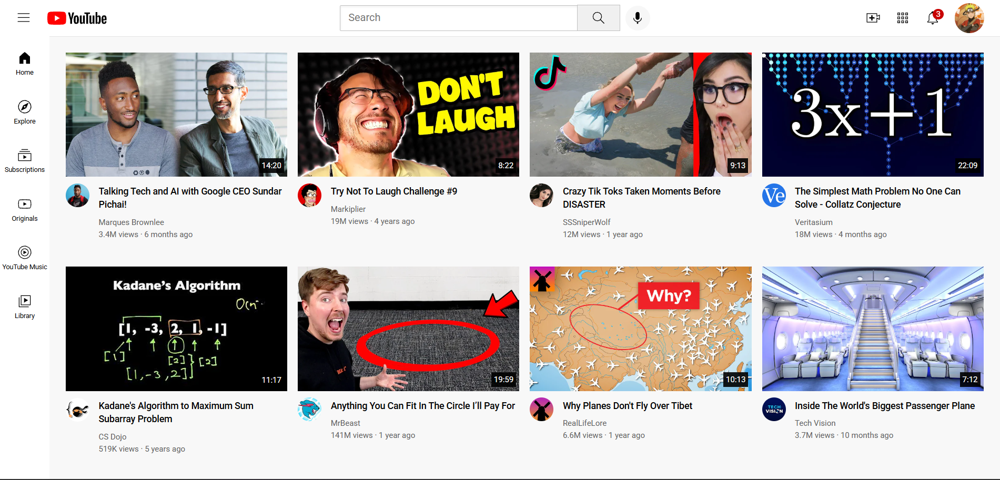

YouTube Clone 🎬

A responsive YouTube homepage clone built with HTML and CSS, featuring a structured layout, navigation sidebar, video cards, and thumbnail-based UI.

✨ Features

- Responsive YouTube-style layout
- Navigation sidebar
- Video thumbnail cards
- Header with search bar
- Clean and structured UI
- Built using pure HTML and CSS

  ## 🖼️ Preview

🛠️ Technologies Used

- HTML5
- CSS3

🚀 How to Run

1. Clone or download this repository.
2. Open the project folder.
3. Open "YOUTUBE.html" in your browser.

📌 Project Status

Completed frontend clone project.

---

Built with HTML & CSS 💻
